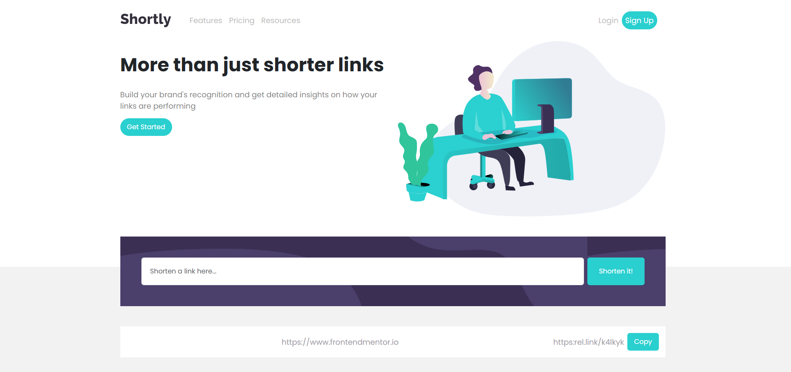
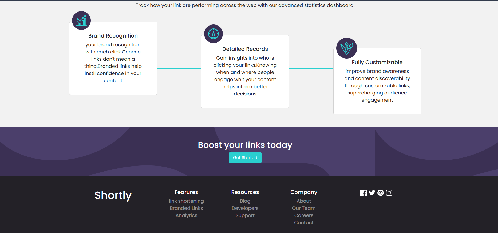

# Alilo Coding — URL Shortener Landing Page

> A professional SaaS landing page for a URL shortening service, built with a full **Gulp 4** automation pipeline, **Pug** templating engine, and **SASS/SCSS**. Features a fully separated `stage/` source and `dist/` production output, a Node.js local server with **LiveReload**, and a rich library of reusable SASS mixins.

---

## 📸 Preview


|---|---|
|  |  |

---

## ✨ Features

- **Gulp 4 Build System** — Automated pipeline for HTML, CSS, JS, with watch + LiveReload
- **Pug Templating** — HTML split into reusable includes (layout, components, sections)
- **SASS/SCSS** — Compiled, autoprefixed, concatenated, and sourcemapped to `dist/css/main.css`
- **JS Minification** — Source JS concatenated and minified via `gulp-minify`
- **Node.js Local Server** — `static-server` serves the `dist/` folder at `localhost:8080`
- **LiveReload** — Browser auto-refreshes on any file change
- **CSS Autoprefixer** — Automatically adds vendor prefixes for the last 2 browser versions
- **Source Maps** — CSS and JS source maps generated for DevTools debugging
- **ZIP Export** — Gulp `compress` task bundles the entire `dist/` into `website.zip`
- **FTP Deploy Ready** — `vinyl-ftp` deploy task included (commented out, ready to configure)
- **Cairo Font** — Self-hosted variable weight Arabic font included (OFL License)
- **Poppins Font** — Google Fonts for Latin content
- **Bootstrap 5** — Grid and utility classes
- **Font Awesome 6** — Self-hosted icon library

---

## 🗂️ Project Structure

```
template1/
│
├── stage/                          # 🔧 SOURCE — edit files here
│   ├── html/
│   │   ├── index.pug               # Main Pug entry point
│   │   └── pug/
│   │       ├── layout/
│   │       │   ├── meta.pug        # <head> meta tags
│   │       │   ├── navbar.pug      # Navbar include
│   │       │   ├── styles.pug      # CSS link tags
│   │       │   └── scripts.pug     # JS script tags
│   │       ├── components/
│   │       │   └── page-head.pug   # Reusable section heading component
│   │       └── sections/
│   │           ├── landing.pug     # Hero section
│   │           ├── statistics.pug  # Shorten form + stats cards
│   │           ├── boostlink.pug   # CTA section
│   │           └── footer.pug      # Footer
│   │
│   ├── css/
│   │   ├── main.scss               # SASS entry — imports all partials
│   │   └── sass/
│   │       ├── helpers/
│   │       │   ├── _variables.scss # Color palette, breakpoints, transitions
│   │       │   └── _mixins.scss    # 20+ reusable SASS mixins
│   │       ├── components/
│   │       │   ├── _button.scss    # Custom button component
│   │       │   └── _page-head.scss # Section heading component
│   │       └── layout/
│   │           ├── _global.scss    # Global reset & base styles
│   │           ├── _navbar.scss    # Navbar styles
│   │           └── sections/
│   │               ├── _landing.scss
│   │               ├── _statistics.scss
│   │               ├── _boostlink.scss
│   │               └── _footer.scss
│   │
│   └── js/
│       └── main.js                 # Custom JS source
│
├── dist/                           # 📦 OUTPUT — compiled production files
│   ├── index.html                  # Compiled HTML from Pug
│   ├── css/
│   │   ├── main.css                # Compiled + autoprefixed + minified CSS
│   │   └── main.css.map            # CSS source map
│   ├── js/
│   │   ├── main.js                 # Concatenated JS
│   │   └── main-min.js             # Minified JS (served in production)
│   ├── images/                     # SVG illustrations & icons
│   └── webfonts/                   # Font Awesome 6 font files
│
├── font/                           # Self-hosted Cairo font (Arabic, variable weight)
│   ├── Cairo-VariableFont_slnt,wght.ttf
│   ├── static/                     # Static weight variants (Light → Black)
│   └── OFL.txt                     # SIL Open Font License
│
├── gulpfile.js                     # Gulp 4 task definitions
├── server.js                       # Node.js static file server (port 8080)
├── package.json                    # NPM dependencies & scripts
├── package-lock.json
├── .gitignore
└── imageGithub/                    # Preview screenshots for README
    └── 1.png, 2.png
```

---

## 🚀 Getting Started

### Prerequisites

- [Node.js](https://nodejs.org/) v14 or higher
- npm (comes with Node.js)

### 1. Clone the repository

```bash
git clone https://github.com/your-username/template1.git
cd template1
```

### 2. Install dependencies

```bash
npm install
```

### 3. Start the development server

```bash
gulp
```

This single command:
1. Starts the Node.js server at **`http://localhost:8080`**
2. Watches `stage/html/**/*.pug` → compiles to `dist/index.html`
3. Watches `stage/css/**/*.scss` → compiles to `dist/css/main.css`
4. Watches `stage/js/*.js` → minifies to `dist/js/main-min.js`
5. Triggers **LiveReload** in the browser on every save

### 4. Open in your browser

```
http://localhost:8080
```

---

## ⚙️ Gulp Tasks

All tasks are defined in `gulpfile.js`:

| Task | Command | Description |
|---|---|---|
| **Default (Watch)** | `gulp` | Starts server + watches all source files with LiveReload |
| **HTML** | `gulp html` | Compiles Pug → HTML into `dist/` |
| **CSS** | `gulp css` | Compiles SASS → autoprefixes → concatenates → writes sourcemap |
| **JS** | `gulp js` | Concatenates + minifies JS into `dist/js/` |
| **Compress** | `gulp compress` | Zips all of `dist/` into `website.zip` |

```js
// gulpfile.js pipeline overview

html()  → src("stage/html/*.pug")   → pug()     → dest("dist/")
css()   → src("stage/css/**")       → sass()
                                    → autoprefixer()
                                    → concat("main.css")
                                    → sourcemaps → dest("dist/css/")
js()    → src("stage/js/*.js")      → concat()  → minify() → dest("dist/js/")
compress() → src("dist/**/*.*")     → zip()     → dest(".")
```

> **FTP Deploy:** A `vinyl-ftp` deploy task is included in `gulpfile.js` (commented out). Fill in your host/user/password and uncomment to enable one-command deployment.

---

## 🎨 SASS Architecture

### Color Variables (`_variables.scss`)

| Variable | Value | Role |
|---|---|---|
| `$Red` | `#F53838` | Primary — buttons, active states |
| `$Gray` | `#F8F8F8` | Secondary — section backgrounds |
| `$RedFlat` | `#FFECEC` | Flat red — hover backgrounds |
| `$Green` | `#2FAB73` | Neutral — success / "Copied" state |
| `$Black` | `#0B132A` | Primary text |
| `$dark-gb` | `#4F5665` | Secondary text |
| `$light-g` | `#AFB5C0` | Placeholder / light text |
| `$Blue-grey` | `#DDE0E4` | Borders / dividers |
| `$redShadow` | `rgba(#F53838, 0.5)` | Button drop shadows |
| `$transition` | `0.3s` | Global transition speed |

### Mixins Library (`_mixins.scss`)

The project ships with **20+ reusable SASS mixins**:

```scss
// Layout & Flexbox
@mixin flex($value)
@mixin flex-direction($direction)
@mixin justify-content($content)
@mixin align-items($alignment)
@mixin align-self($alignment)

// Sizing
@mixin size($width, $height: $width)   // square shortcut
@mixin circle($size, $color: black)    // perfect circle

// Spacing
@mixin margin($top, $right, $bottom, $left)

// Typography
@mixin font($size, $weight: normal, $style: normal)
@mixin font-weight($weight)
@mixin text-style($style)

// Backgrounds
@mixin background($value)
@mixin background-color($color)
@mixin background-image($url)
@mixin background-repeat($repeat)

// Borders
@mixin border($width, $style: solid, $color: black)
@mixin border-radius($radius)

// Interaction
@mixin hover($type, $color)   // type: "back" | "color"

// Shapes
@mixin flipUp($size, $direction)   // direction: "h" | "v"
```

### Usage example

```scss
.custom-button {
  @include size(160px, 56px);
  @include border-radius(28px);
  @include background-color($Red);
  @include hover("back", darken($Red, 10%));
  box-shadow: 0 20px 30px $redShadow;
}
```

---

## 🖋️ Pug Architecture

HTML is fully componentized using Pug `include` statements:

```pug
// stage/html/index.pug
doctype
html
  head
    include pug/layout/meta.pug      // charset, viewport, title
    include pug/layout/styles.pug    // all CSS <link> tags
  body
    include pug/layout/navbar.pug
    include pug/sections/landing.pug
    include pug/sections/statistics.pug
    include pug/sections/boostlink.pug
    include pug/sections/footer.pug
    include pug/layout/scripts.pug   // all <script> tags
```

To add a new section:
1. Create `stage/html/pug/sections/my-section.pug`
2. Add `include pug/sections/my-section.pug` in `index.pug`
3. Create `stage/css/sass/sections/_my-section.scss`
4. Import it in `stage/css/main.scss`

---

## 📄 Sections Overview

| Section | Description |
|---|---|
| **Navbar** | Responsive Bootstrap navbar — Logo, Features/Pricing/Resources, Login, Sign Up pill button |
| **Landing / Hero** | Two-column: headline + "Get Started" CTA (left), SVG illustration (right) |
| **Statistics** | Link shortener form + list of shortened links + 3 feature cards (Brand Recognition, Detailed Records, Fully Customizable) |
| **Boost CTA** | Dark background section — "Boost your links today" + Get Started |
| **Footer** | 4-column: Brand name, Features, Resources, Company links + Social icons (Facebook, Twitter, Pinterest, Instagram) |

---

## 🛠️ Built With

| Technology | Version | Purpose |
|---|---|---|
| [Gulp](https://gulpjs.com/) | 4.0.2 | Task automation & build pipeline |
| [gulp-pug](https://github.com/gulp-community/gulp-pug) | 5.0.0 | Pug → HTML compilation |
| [gulp-sass](https://github.com/dlmanning/gulp-sass) | 5.1.0 | SASS → CSS compilation |
| [gulp-autoprefixer](https://github.com/sindresorhus/gulp-autoprefixer) | 8.0.0 | CSS vendor prefix automation |
| [gulp-concat](https://github.com/gulp-community/gulp-concat) | 2.6.1 | File concatenation |
| [gulp-minify](https://github.com/palmfjord/gulp-minify) | 3.1.0 | JS minification |
| [gulp-sourcemaps](https://github.com/gulp-sourcemaps/gulp-sourcemaps) | 3.0.0 | Source map generation |
| [gulp-livereload](https://github.com/vohof/gulp-livereload) | 4.0.2 | Browser auto-refresh |
| [gulp-zip](https://github.com/sindresorhus/gulp-zip) | 5.1.0 | Production ZIP export |
| [vinyl-ftp](https://github.com/morris/vinyl-ftp) | 0.6.1 | FTP deployment (optional) |
| [static-server](https://github.com/nbluis/static-server) | 2.2.1 | Node.js local dev server |
| [Bootstrap](https://getbootstrap.com/) | 5.x | Grid & UI utilities |
| [Font Awesome](https://fontawesome.com/) | 6.x | Self-hosted icons |
| [Poppins](https://fonts.google.com/specimen/Poppins) | — | Latin typeface (Google Fonts) |
| [Cairo](https://fonts.google.com/specimen/Cairo) | — | Arabic variable font (self-hosted, OFL) |

---

## 🌐 Browser Support

Defined in `package.json` via Browserslist and applied automatically by `gulp-autoprefixer`:

```json
"browserslist": [
  "last 2 versions",
  "> 2%"
]
```

| Browser | Support |
|---|---|
| Chrome | ✅ Latest 2 versions |
| Firefox | ✅ Latest 2 versions |
| Safari | ✅ Latest 2 versions |
| Edge | ✅ Latest 2 versions |
| IE | ❌ Not supported |

---

## 📦 Available Scripts

```bash
# Start dev server + watch + LiveReload
gulp

# Start only the Node.js server (no Gulp watch)
npm start

# Build HTML only
gulp html

# Build CSS only
gulp css

# Build JS only
gulp js

# Export dist/ as website.zip
gulp compress
```

---

## 📝 Customization Guide

**Change primary color:** Update `$Red` in `stage/css/sass/helpers/_variables.scss`:
```scss
$Red: #your-color;
$redShadow: rgba($Red, 0.5);  // shadow updates automatically
```

**Add a navbar link:** Edit `stage/html/pug/layout/navbar.pug` and add a new `li.nav-item`.

**Add a new page section:**
1. Create `stage/html/pug/sections/my-section.pug`
2. `include pug/sections/my-section.pug` in `index.pug`
3. Create `stage/css/sass/sections/_my-section.scss`
4. `@import "sass/sections/_my-section.scss";` in `main.scss`
5. Save — Gulp auto-compiles and LiveReload refreshes the browser

**Enable FTP deploy:** In `gulpfile.js`, uncomment the `deploy` function and fill in your server credentials:
```js
var conn = ftp.create({
  host: "your-domain.com",
  user: "your-username",
  password: "your-password",
});
```

---

## 📜 License

This project is open-source and available under the [MIT License](LICENSE).

The **Cairo** font is licensed under the [SIL Open Font License 1.1](font/OFL.txt).

---

## 🙋 Author

**Alilo Alaedine**
- GitHub: [@your-username](https://github.com/your-username)

---

> ⭐ If you found this project useful, consider giving it a star on GitHub!
